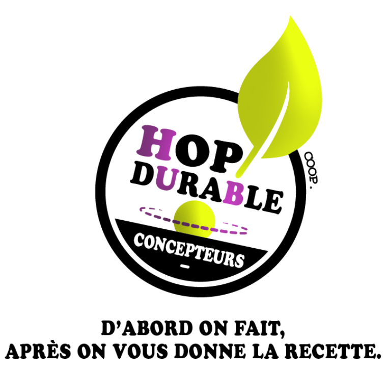

<section class="center">
  <nav class="site-nav">
    <ul>
      <li><a href="/hop-durable-startup.html">Start-Up Coopérative ?</a></li>
    </ul>
  </nav>
  
   
  <a href="assets/pdf/hop_amenagement_durable_web_6.pdf" class="button">Accéder à la présentation Hop!</a>
  
  
    Allez voir par là pour en apprendre plus
  

</section>

 
<section markdown="1" class="center">
# Notre ambition
*Promouvoir une culture de l’aménagement durable par des lieux de référence à pédagogie active*
 
 

  <a href="assets/images/fond-valeurs.svg" class="button">Nos valeurs</a>

</section>
 
 
<section markdown="1">

# Une culture de l’aménagement durable à créer

L’apport des sciences dans la connaissance du globe et notre dépendance aux ressources naturelles ne cesse de croître. Notre perception de l’espace, qu’il se transforme ou non physiquement, évolue. Indiscutablement, l’aménagement des territoires s’inscrit aujourd’hui dans un « développement durable», **un développement qui réponde aux besoins du présent sans compromettre les capacités des générations futures à répondre aux leurs.**

L'approche opérationnelle d'Hop!Durable, **pragmatique, créative & coopérative** lève les obstacles du financement pour créer références & outils afin de faire évoluer les regards sur les enjeux actuels de nos territoires & donner à chacun le pouvoir d’agir.
</section>

<section markdown="1">

# Un partenariat public/privé au service du territoire : la coopérative

La coopération est au coeur de notre approche opérationnelle de l’aménagement durable.

Nous en sommes convaincus : **échanger, partager nos compétences et agir ensemble pour un projet commun est essentiel pour créer une dynamique de territoire efficace et pérenne**.

Ainsi Hop!Durable réunit des partenaires variés : partenaires **scientifiques**, **professionnels** (entreprises, fournisseurs, artisans, interprofessions), **collectivités**, maîtres d’ouvrage privés, **structures d’Insertion** par l’Activité Economique, bénévoles, artistes, etc.
</section>
  
<section markdown="1">

# Que cherchez-vous ?

  - Je souhaite **aménager des espaces**
  - Je propose des **produits durables** : matériaux, mobiliers, végétaux, etc.
  - Je cherche des partenaires opérationnels pour **expérimenter et/ou valoriser des travaux** de recherche
  - Je cherche à créer des actions de **sensibilisation** sur des thématiques environnementales ou culturelles
  - Je souhaite travailler sur la **valorisation métier** des structures d’insertion
  - Je souhaite **soutenir le développement d'Hop!Durable**

</section>

<section markdown="1" class="center">

# Contacter Hop!
Courriel : **contact@hopdurable.fr**

Nous suivre sur Facebook : **@hopdurable**

 
 

  <a href="assets/pdf/hop-durable_recherche_concepteur.pdf" class="button">Hop! recherche 1 concepteur/trice ! </a>

  
</section>    

<section>
    
    
    Je n'arrive pas à m'inscrire ? Fais le nous savoir : contact@hopdurable.fr
  
</section>
