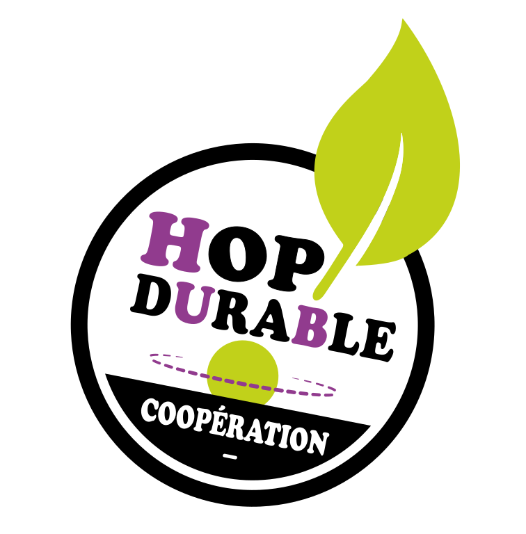

<section class="center">
  <nav class="site-nav">
    <ul>
      <li><a href="/hop-durable-gouvernance.html" class="button button--action">Start-Up de Territoire ?</a></li>
    </ul>
  </nav>
  
   
    
  
  
    
  

</section>

 
<section markdown="1" class="center">
# Notre ambition
**Promouvoir une culture de l’aménagement durable ancrée sur le territoire, portée par et pour ses acteurs**
 

</section>
 
 
<section markdown="1">

# L'aménagement durable : un enjeu de société
A la croisée de plusieurs métiers & filières
>Indissociable d'une approche de territoire

</section>

<section markdown="1">

# La coopération au service du territoire

La coopération est au coeur de notre approche opérationnelle de l’aménagement durable.

Nous en sommes convaincus : **échanger, partager nos compétences et agir ensemble pour un projet commun est essentiel pour créer une dynamique de territoire efficace et pérenne**.

Ainsi Hop!Durable réunit des partenaires variés : partenaires **scientifiques**, **professionnels** (entreprises, fournisseurs, artisans, interprofessions), **collectivités**, maîtres d’ouvrage privés, **structures d’Insertion** par l’Activité Economique, bénévoles, artistes, etc.
</section>
  
<section markdown="1">

# Que cherchez-vous ?

  - Je souhaite **aménager des espaces**
  - Je propose des **produits durables** : matériaux, mobiliers, végétaux, etc.
  - Je cherche des partenaires opérationnels pour **expérimenter et/ou valoriser des travaux** de recherche
  - Je cherche à créer des actions de **sensibilisation** sur des thématiques environnementales ou culturelles
  - Je souhaite travailler sur la **valorisation métier** des structures d’insertion
  - Je souhaite **soutenir le développement d'Hop!Durable**

</section>

<section markdown="1" class="center">

# Contacter Hop!
Courriel : **contact@hopdurable.fr**

Nous suivre sur Facebook : **@hopdurable**

 
 

  <a href="assets/pdf/hop-durable_recherche_concepteur_2.pdf" class="button">Hop! recherche 1 concepteur/trice ! </a>

  
</section>    

<section>
    
    
    Je n'arrive pas à m'inscrire ? contact@hopdurable.fr
  
</section>
