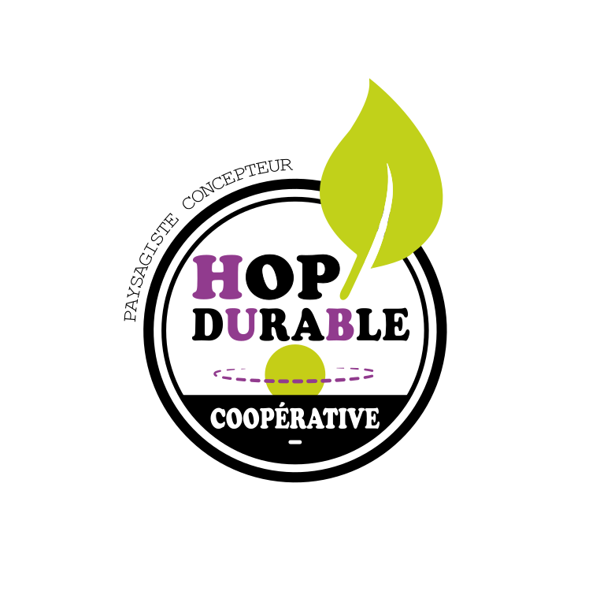

<section class="center">
  
   
<strong>Promouvoir une culture de l’aménagement durable</strong>

  
Par des lieux de références à pédagogie active

   
  
  <a href="assets/pdf/hop_amenagement_durable_web.pdf" class="button">Accéder à la présentation Hop! </a>
 </section>

<section markdown="1">

# HOP!Durable : notre offre

## Créer des espaces durables

  - de haute qualité paysagère
  - à pédagogie active
  - aux coûts optimisés
  - par une coopération win/win avec des acteurs locaux et/ou métier

## Pour quels espaces ?

Du massif fleuri au lieu d’éveil ludique ou à l’espace de détente urbaine, tous les espaces nous intéressent.

</section>

<section markdown="1">
<section class="center">
# Une culture de l’aménagement durable à créer

L’apport des sciences dans la connaissance du globe et notre dépendance aux ressources naturelles ne cesse de croître. Notre perception de l’espace, qu’il se transforme ou non physiquement, évolue. Indiscutablement, l’aménagement des territoires s’inscrit aujourd’hui dans un « développement durable», **un développement qui réponde aux besoins du présent sans compromettre les capacités des générations futures à répondre aux leurs.**

L'approche opérationnelle d'HOP!Durable, **pragmatique, créative & coopérative** lève les obstacles du financement pour créer références & outils afin de faire évoluer les regards sur les enjeux actuels de nos territoires & donner à chacun le pouvoir d’agir.
</section>

<section markdown="1">

# Une coopérative : pourquoi ?

La coopération est au coeur de notre approche opérationnelle de l’aménagement durable.

Nous en sommes convaincus : **échanger, partager nos compétences et agir ensemble pour un projet commun est essentiel pour créer une dynamique de territoir efficace et pérenne**.

Ainsi HOP!Durable réunit des partenaires variés : partenaires **scientifiques**, **professionnels** (entreprises, artisans, interprofessions), **collectivités**, maîtres d’ouvrage privés, **structures d’Insertion** par l’Activité Economique, bénévoles, artistes, etc.
</section>
  
<section markdown="1">

# Que cherchez-vous ?

  - Je souhaite aménager des espaces durables
  - Je propose des produits durables (mobilier, végétal, matériaux, etc.)
  - Je cherche des partenaires R&D sur de l’expérimentation et/ou valorisation
  - Je cherche à développer des actions de sensibilisation sur des thématiques environnementales ou culturelles
  - Je souhaite travailler sur la valorisation métier des structures d’insertion
  - Je souhaite soutenir HOP!Durable
  </section>

<section markdown="1">

# Contacter Hop!
Courriel : **contact@hopdurable.fr**

Nous suivre sur Facebook : **@hopdurable**

<a href="assets/pdf/hop_amenagement_durable_web.pdf" class="button">La plaquette Hop! </a>

