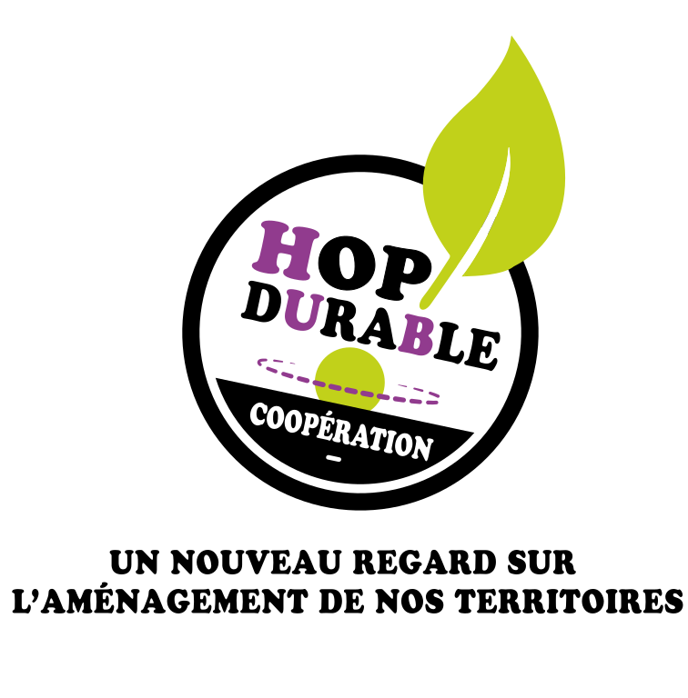
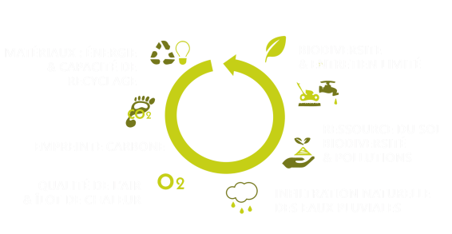

<section class="center">
  <nav class="site-nav">
    <ul>
      <li><a href="/hop-durable-gouvernance.html" class="button button--action">Start-Up de Territoire ?</a></li>
    </ul>
  </nav>
  
   
    
  
  
    
  

</section>

 
<section markdown="1" class="center">
# L'aménagement durable : un enjeu de société

 
 
• **A la croisée de plusieurs métiers et filières**  
• **Indissociable d'une approche de territoire**

</section>

<section markdown="1">

# Le constat  

**Un manque d’une culture de l’aménagement durable partagée à l’échelle opérationnelle**  

**Pourquoi ?**  

• Sujets complexes, R&D  

• Inertie dans l’évolution des pratiques  

• Multiplicité d’acteurs  

• Manque d’outils  

• Manque d’exemples locaux  

# L'ambition
**Promouvoir une culture de l’aménagement durable ancrée sur le territoire, portée par et pour ses acteurs**  

</section>

<section markdown="1">

# La solution Hop!Durable 

**Une offre complète & innovante - Nous :**  
 
• **Identifions, valorisons** les acteurs engagés à l’échelle locale et **créons** les outils adaptés pour favoriser l’appropriation de solutions durables  
• **Démontrons** au plus près des acteurs par la réalisation de lieux physiques pédagogiques ancrés sur le territoire en participant à son attractivité et sa valorisation  
• **Accompagnons** le transfert des projets de R&D à l’échelle locale, par l’expérimentation et la valorisation des résultats  
 

</section>
  
<section markdown="1">

Hop!Durable : Start-Up de Territoire ?  
Nos soutiens  
En ce moment !  
Nous contacter : contact@hopdurable.fr  
Nous suivre sur Facebook : @hopdurable

  

  <a href="assets/pdf/hop-durable_recherche_concepteur_2.pdf" class="button">Hop! recherche 1 concepteur/trice ! </a>

  

  
</section>
