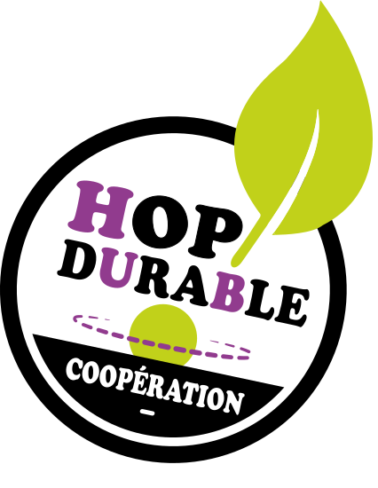

 

<section>

  

    
    
Notre ambition : promouvoir une culture de l‘aménagement durable

    
  

</section>

<section class="black">

# Constat

## un manque d’une culture de l’aménagement durable partagée à l’échelle opérationnelle
La cohérence et l’efficacité de la déclinaison des politiques publiques (énergie, biodiversité, etc.) depuis les échelles supra-communales jusqu’aux échelles opérationnelles en dépendent.

## Un enjeu de société transverse à porter collectivement, indissociable d&#39;une approche de territoire

 - <svg xmlns="http://www.w3.org/2000/svg" version="1.1" class="svg-size" viewBox="0 0 80 80"><use xlink:href="{{ site.baseurl }}/assets/images/symbols.svg#hd-eco-light" /></svg> Matériaux : énergie et capacité de recyclage
 - <svg xmlns="http://www.w3.org/2000/svg" version="1.1" class="svg-size" viewBox="0 0 80 80"><use xlink:href="{{ site.baseurl }}/assets/images/symbols.svg#hd-foot" /></svg> Empreinte carbone
 - <svg xmlns="http://www.w3.org/2000/svg" version="1.1" class="svg-size" viewBox="0 0 80 80"><use xlink:href="{{ site.baseurl }}/assets/images/symbols.svg#hd-earth-oxygen" /></svg> Qualité de l‘air & îlots de chaleur

<!-- /Second list -->
 - <svg xmlns="http://www.w3.org/2000/svg" version="1.1" class="svg-size" viewBox="0 0 80 80"><use xlink:href="{{ site.baseurl }}/assets/images/symbols.svg#hd-cloud" /></svg> Infiltration naturelle des eaux pluviales
 - <svg xmlns="http://www.w3.org/2000/svg" version="1.1" class="svg-size" viewBox="0 0 80 80"><use xlink:href="{{ site.baseurl }}/assets/images/symbols.svg#hd-hand-earth" /></svg> Ressources du sol biodiversité & pollutions
 - <svg xmlns="http://www.w3.org/2000/svg" version="1.1" class="svg-size" viewBox="0 0 80 80"><use xlink:href="{{ site.baseurl }}/assets/images/symbols.svg#hd-leaf" /></svg> Biodiversité & entretien limité

 
#Pourquoi ?

 - Manque d’exemples locaux de référence  
 - Faible valorisation du «caractère durable» des aménagements  
 - Approches innovantes perçues comme complexes (R&D)  
 - Multiplicité d’acteurs, de métiers &amp; filières  
 - Nécessité de l’approche territoriale peu reconnue  
 

</section>

<section>

# Notre solution  
## Une offre complète et innovante  
- Démontrons au plus près des acteurs par la réalisation d’espaces-produits originaux, références en matière d’aménagement durable et supports de pédagogie active. Aux coûts optimisés, ces démonstrateurs de proximité, ancrés sur le territoire, participent à son attractivité et sa valorisation.  
 
- Valorisons un réseau de partenaires locaux en promouvant leur activité, leur savoirfaire et leur engagement vis-à-vis du territoire rhonalpin.  
 
- Créons un cadre propice à l’expérimentation pour accompagner le développement de solutions durables innovantes sur le territoire rhonalpin en animant une coopération d’acteurs engagés.  

 
